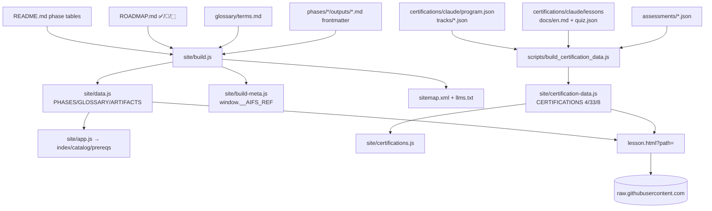

# AI Engineering from Scratch — LLM Knowledge Pack

> **Give this file to an LLM.** It contains everything the model needs to understand the project and to make exceptional, elegant UX/UI changes. For the canonical curriculum README, see `README.md`. This pack is the fork’s technical + design source of truth as of `cf50b8e4` (`523` lessons, `20` phases, live at `https://ai-engineering-from-scratch-mu-dun.vercel.app/`).

---

## 1. What this is in one paragraph

523 lessons, 20 phases, ~342 hours, 4 languages (Python, TypeScript, Rust, Julia). Every lesson is `docs/en.md` + `code/main.*` + `quiz.json` + `outputs/skill|prompt|agent|mcp`. The loop is *Build It / Use It*: you write backprop, the tokenizer, the attention mechanism and the agent loop by hand, then you run the same thing through the production library. The **fork** adds a reading dashboard (accounts, streaks, resume, heatmap) on top of the upstream curriculum without forking the lessons themselves. The site is **vanilla HTML/CSS/JS** (no React), ships static to Vercel, and hydrates progress from Neon Postgres via 11 Vercel Functions.

---

## 2. How to think about this repo (mental model for an LLM)

- **`site/` is the product.** `site/build.js` is the compiler. `README.md` + `ROADMAP.md` + `glossary/terms.md` are the sources. `site/data.js` (`PHASES`/`GLOSSARY`/`ARTIFACTS`) and `site/certification-data.js` (`CERTIFICATIONS`) are generated compilers outputs — never hand-edit them.
- **Two data pipelines, one build.** `vercel.json: buildCommand = "node site/build.js && node scripts/build_certification_data.js"` runs on every Vercel deploy and on CI `main` (which auto-commits `site/data.js`).
- **Auth is a thin slice.** `api/` is 11 files, `pg` with `max:2`, `aifs_session` HttpOnly cookie. All curriculum content is public; only progress/streak is per-user.
- **Styles are tokens + inline.** `site/style.css` holds the design system; `site/index.html` holds an inline `<style>` for above-the-fold masthead / course-paths / certification-spotlight for perf. Change tokens there, not in `data.js`.
- **Responsive is mobile-first + container queries.** Header is `fixed 64px`, `1360px` max-width, `250ms` drawer. Dashboard uses `@container` (`inline-size`), not just viewport.

If you are an LLM asked to “make the UX more elegant”, start at `site/style.css:1` tokens and `site/index.html:68` masthead, not at `site/data.js`.

---

## 3. Repo layout — full tree

```text
.
├── site/                         # → Vercel outputDirectory (112 files)
│   ├── index.html                # marketing + TOC modal + course-paths + cert spotlight + dashboard-promo
│   ├── lesson.html               # reader ?path=phases/..&scroll=&section=&track=&learningPath=
│   ├── catalog.html              # 523-row sortable table
│   ├── prereqs.html              # roadmap dependency graph
│   ├── glossary.html             # searchable cards
│   ├── dashboard.html            # heatmap, streak, continue, donut
│   ├── learning-paths.html       # 4 domains + 6 career routes
│   ├── certifications.html       # catalog grid
│   ├── certification.html        # ?id=track detail (hero, domains, lessons, assessments, plans)
│   ├── assessment.html           # ?id=&result=latest timed practice
│   ├── about.html developer.html contact.html privacy.html 404.html
│   ├── style.css                 # 3150+ lines — tokens, header, masthead, marquee, modal, lesson, dashboard, responsive
│   ├── app.js                    # theme, stats, phases grid (#phasesGrid), modal, marquee, reveal, copy, GH stars
│   ├── data.js                   # GENERATED const PHASES, GLOSSARY, ARTIFACTS
│   ├── certification-data.js     # GENERATED const CERTIFICATIONS {program,tracks,lessonsByPath,assessmentsById}
│   ├── build.js                  # 629 lines — the curriculum compiler
│   ├── build-meta.js             # window.__AIFS_REF (branch for raw.githubusercontent fetch)
│   ├── langs.js lang-picker.js nav.js header.js cmdpalette.js
│   ├── progress.js reading-progress.js streak.js sync.js auth.js google-auth.js
│   ├── certifications.js certification-progress.js learning-paths.js roadmap.js
│   ├── tts.js figures.js figures-*.js (40+ SVGs) sitemap.xml llms.txt
│   └── assets/figures/006-ai-engineering-learning-paths*.svg logos/ og-image.png
├── phases/                       # 20 × NN-slug / NN-lesson-slug / {code,docs/en.md,quiz.json,outputs}
│   ├── 00-setup-and-tooling (12) 01-math-foundations (22) 02-ml-fundamentals (18) 03-deep-learning-core (13) …
│   └── 19-capstone-projects     # each lesson: 6 beats MOTTO→PROBLEM→CONCEPT→BUILD→USE→SHIP
├── certifications/claude/        # 33 lessons, 4 tracks, 8 assessments, 295 questions
│   ├── program.json              # claude-certifications, 1.0.0-local-preview, lastVerified 2026-08-09, tracks:[ccao-f,ccdv-f,ccar-f,ccar-p]
│   ├── tracks/*.json             # ccao-f (9 lessons, 60q), ccdv-f (15), ccar-f (22), ccar-p (26)
│   ├── lessons/NN-slug/          # shared across tracks
│   ├── assessments/*/{diagnostic,mock-01}.json
│   ├── prerequisites.json        # DAG
│   └── GETTING_STARTED.md
├── api/                          # Vercel Functions, Node >=18, pg
│   ├── auth/signup.js login.js google.js logout.js me.js
│   ├── lib/db.js helpers.js session.js streak.js verify-google.js
│   └── progress.js
├── glossary/terms.md             # 120+ terms, 12 categories → GLOSSARY
├── learning-paths/*.json         # 12 files: 4 core + 6 career + 2 focused (agent-skills, mcp)
├── scripts/                      # 27 files: audit, build, translate, test
│   ├── audit_lessons.py audit_certifications.py build_catalog.py check_readme_counts.py
│   ├── build_certification_data.js   # ← fork’s CERTIFICATIONS emitter (verbatim from upstream build.js:1350)
│   └── dev-server.mjs test-*.js
├── .github/workflows/curriculum.yml  # audit + readme-counts-sync + site-rebuild (main)
├── vercel.json                   # buildCommand, 14 rewrites, cache headers
├── package.json                  # pg ^8.13.1 only — stdlib-first
├── languages.json                # 40 langs → site/langs.js
├── README.md ROADMAP.md AGENTS.md LESSON_TEMPLATE.md
└── assets/ banner.svg  book/ volumes.json  i18n/
```

Recent fork commits (so you know the delta vs `rohitg00/main`):

```text
c3fc793a fix(api): drop api/markdown|lesson|certification (14→11 fns) — Hobby 12 limit
f8cb6f62 feat(site): route 7 standalone pages, add build_certification_data.js, fix lesson?path→lesson.html?path (37+70+3)
9f322017 feat(site): inline course-paths + certification-spotlight into index.html, fix header 1200→1360 + footer wrap
cf50b8e4 feat(site): add header-priority-nav (Contents/Catalog/Dashboard), fix preface/colophon @768 mobile overflow
```

---

## 4. Tech stack and constraints

| Layer | Choice | Constraint |
|---|---|---|
| Frontend | Vanilla HTML/CSS/JS, no React, no bundler | Curriculum is the product; keep the fork stdlib-first |
| CSS | `site/style.css` + inline `site/index.html:68` `<style>` | Tokens only; Mermaid or SVG for diagrams, never ASCII |
| Data | `site/data.js` + `site/certification-data.js` | Generated; hard rule: never commit `catalog.json`, `site/data.js` is rebuilt by CI, `package-lock.json` never tracked |
| Backend | Vercel Functions Node 18, `pg` → Neon Postgres `max:2` | `aifs_session` HttpOnly `SameSite=Lax` + `Secure` on `x-forwarded-proto:https` |
| Auth deps | `pg`, `ws` only when needed | Allowlist: `numpy torch h5py zstandard safetensors` (py), `hono zod ws` (ts) |
| Commits | `feat(phase-NN/MM): <slug>` ≤72 chars, one commit per lesson dir | 10-lesson PR = 10 commits |

**`vercel.json` as of `cf50b8e4`:**

```json
{
  "buildCommand": "node site/build.js && node scripts/build_certification_data.js",
  "outputDirectory": "site",
  "framework": null,
  "installCommand": "npm install --no-audit --no-fund",
  "rewrites": [
    { "source": "/glossary", "destination": "/glossary.html" },
    { "source": "/catalog", "destination": "/catalog.html" },
    { "source": "/path", "destination": "/prereqs.html" },
    { "source": "/roadmap", "destination": "/prereqs.html" },
    { "source": "/dashboard", "destination": "/dashboard.html" },
    { "source": "/about", "destination": "/about.html" },
    { "source": "/developer", "destination": "/developer.html" },
    { "source": "/contact", "destination": "/contact.html" },
    { "source": "/privacy", "destination": "/privacy.html" },
    { "source": "/learning-paths", "destination": "/learning-paths.html" },
    { "source": "/certifications", "destination": "/certifications.html" },
    { "source": "/certification", "destination": "/certification.html" },
    { "source": "/assessment", "destination": "/assessment.html" }
  ]
}
```

Headers: `css|js|png|svg|woff2` `86400 / s-maxage 604800`, `certification-data.js|build-meta.js` `no-cache`, `*.html` `300/86400`.

---

## 5. Data flow — the two pipelines



`site/build.js:629` does: `resolveRef()` (`VERCEL_GIT_COMMIT_REF` else `git rev-parse`) → `parseRoadmap` (`^## Phase (\d+).*— (✅|🚧|⬚)`) → `parseReadme` (phase `### Phase` + `<summary><b>Phase` + `| # | Lesson | Type | Lang |`) → `parseGlossary` → `discoverArtifacts` (`outputs/skill|prompt|agent-*.md` + `mission.md`) → `extractLessonMeta` (first `> ` ≤180ch + all `###` keywords) → `writeBuildMeta` + `writeLangs` + `syncCounts` → `writeSitemap`.

`scripts/build_certification_data.js` is a verbatim extract of upstream `site/build.js:1350` `parseCertifications()` → `CERTIFICATIONS {program,tracks,lessonsByPath,assessmentsById}` with `quizVersion SHA256`, `domainsByTrack`, `rolesByTrack`; the 70 track→lesson refs all resolve, 0 missing — verified via `audit_certifications.py`.

---

## 6. API and DB — what an LLM needs to not break

**DB Neon (4 tables):**

```text
users(id BIGSERIAL PK, email UNIQUE, name, provider, google_sub, picture, pw_hash, pw_salt)
sessions(token_hash UNIQUE SHA256, user_id FK, expires_at)
progress(PK user_id,path, scroll_pct max-merge, read_seconds sum, completed OR, answers jsonb merge, section_id, last_visited)
study_days(PK user_id,day DATE, minutes REAL sum)  -- 5 min/day = valid
```

**API `api/`:**

```text
POST /api/auth/signup  {name,email,password} → scrypt + set-cookie aifs_session
POST /api/auth/login   {email,password}
POST /api/auth/google  {credential: GIS JWT} → verify-google.js → upsert provider=google
POST /api/auth/logout  → clear Max-Age=0
GET  /api/auth/me      → {user, progress:{path:{scrollPct,readSeconds,completed,answers}}, streak:{current,longest,totalDays,dayMinutes}}
POST /api/progress     → {items:[{path,deltaSeconds,scrollPct,sectionId,completed,answers}], deltaMinutes, day}
```

`api/lib/db.js` is a `RetryingPool` (`max:2`, `rejectUnauthorized:false`, 2s wake retry). `api/lib/helpers.js` parses `512KB` body and sets `aifs_session` `HttpOnly SameSite=Lax; Secure` if `x-forwarded-proto:https`. `site/auth.js:182` `window.AIFSAuth` mirrors `localStorage aifs:auth:cache` and dispatches `aifs:me`. `site/sync.js:168` debounces `8000ms` + `30000ms` retry and uses `sendBeacon` on `pagehide`.

**Dashboard `site/dashboard.html`:** hero avatar, 8 stat cards, `Continue Reading` (last `lastVisited`), `Today 5 min` bar, donut `2π·52`, 28-day heatmap (`dash-heat-day read/today`), progress list. Hydrates guest `localStorage aifs:progress:v1` vs server `progress` via `sync.js`.

---

## 7. Current UX/UI — what’s elegant and what was just fixed

**Design system (keep):** tokens `--blueprint #3553ff`, `--bg #fafaf5`/`#0a0d1a`, `--ink #1a1a1a`, `--rule-soft rgba(26,26,26,0.16)`, `--header-bg rgba(250,250,245,0.94)`, `--header-offset 92px`; type `VT323` display / `Source Serif 4` body / `JetBrains Mono` mono; header `fixed 64px blur(10px)`, motion `--motion-press 160ms --motion-feedback 180ms --motion-enter 220ms --motion-drawer 250ms --ease-drawer cubic-bezier(0.32,0.72,0,1)`; `a:focus-visible {outline:2px solid var(--blueprint); outline-offset:2px}` everywhere; `prefers-reduced-motion` disables marquee/fig animations.

**Already correct (don’t regress):** `course-paths` figure — desktop 4 absolute nodes `left 2.5/26.6/50.8/75% top46.9% w22.5% h35.3% hover inset 0 0 0 3px` → mobile `grid gap8 ::before 3px vertical line` + `compact-root 48px 2px`; `certification-spotlight` — grid `124px 1fr 210px` + `clip-path polygon` scalloped badge + `inset 3px` border, collapses at `900→112px 1fr`, `640→92px`, `480→82px`; `masthead-figure` 3 cycling plates with dot nav.

**Fixed in this fork (so you don’t reintroduce the bugs):**

| Bug | Fix | File:line |
|---|---|---|
| Header overflow: 7 links + `gap28` + `max-width1200` pushed `AI / FROM SCRATCH` to two lines at `1280px` | `max-width 1200→1360`, `gap28→20`, `logo white-space:nowrap flex:0 1 auto min-width:0 margin-inline-end:auto`, `header-nav white-space:nowrap flex:0 0 auto` | `site/style.css:239` `site/index.html:2205` |
| Header hid all links at `1360px` (0 visible vs original’s 3) | Added `header-priority-nav` (`Contents/Catalog/Dashboard`) visible at `1280px`, hidden at `820px`; drawer still at `1360px` | `site/index.html:2214` `site/style.css:280` |
| `BODY 500px` at `390px` (footer + preface 2-col) | `.footer-links {flex-wrap:wrap}`, `preface-grid/colophon-grid →1fr` at `768px`, `colophon-cmd code` wrap at `480px` | `site/style.css:793` `site/index.html:2192` |
| `course-paths` + `certification-spotlight` missing (fork kept old `index.html`) | Inlined upstream HTML+CSS into `index.html` after `preface` and after `books`; 37+70 `lesson?path` → `lesson.html?path` | `site/index.html:1520` |
| 7 standalone pages `404` / used removed APIs | 11 fns (Hobby 12 limit), `scripts/build_certification_data.js` + 14 rewrites + 3 `lesson.html?path` fixes | `vercel.json:2` `site/certifications.js:134` |

Live verified after `cf50b8e4`: `GET / 200`, `GET /learning-paths|/certifications|/certification?id=claude-ccao-f|/assessment|/dashboard|/glossary|/catalog 200`, `GET /certification-data.js 200 1.3MB`, `BODY 390` no horizontal scroll at `390px`, drawer `closed→open` + `LOG IN→authOverlay` works.

**Still “good, not exceptional” — polish without touching curriculum:**

- **Header:** priority should be `Contents/Catalog/Learning Paths` like upstream (we use `Dashboard`); consider 4 links with `gap14 0.74rem` at `1480→1401px` so `52.3k` star doesn’t clip.
- **Masthead:** inline `<style>` at `site/index.html:68` duplicates `site/style.css` masthead grid (`≥1280px 1fr minmax(360px,400px)`). Extract to `site/style.css` and add `content-visibility:auto` to below-fold `course-paths`/`certification-spotlight`.
- **Hero CTAs:** `site/index.html:433` `masthead-cta grid 1fr 1fr 1.28fr 1.12fr → 2×2 at 601-760 → 1fr at 390` with `min-width:0 white-space:nowrap` is correct, but star `52.3k` can wrap at `375px`; keep `border-left` count + `tabular-nums`.
- **Preface/colophon:** already `1fr` at `768px`, but `preface-body column-count:2` still `justify hyphens` — at `390px` it can river; we added `left` at `480px`, consider `font-size 0.96rem` throughout.
- **Catalog/glossary:** `catalog-table-wrap overflow-x:auto min-width640` is correct; filter chips may need `flex-wrap` at `390px`; glossary cards would benefit from `content-visibility:auto`.

---

## 8. How to make an exceptional, elegant change — the playbook

> **For an LLM:** change `site/style.css` tokens → `site/index.html` inline `<style>` → `site/*.html` + `site/app.js` behavior. Never touch `site/data.js`.

**Step 1 — Pick viewports:** test at `390, 768, 1280, 1440` (header) + `390` (hero, preface, colophon).

```bash
python3 -m http.server 8899 --directory site
# or with API
node scripts/dev-server.mjs   # http://localhost:8787
```

```javascript
// /tmp/check.js — language: javascript
const { chromium } = require('./node_modules/playwright/index.js');
const b = await chromium.launch();
const ctx = await b.newContext({ viewport: { width: 390, height: 844 } });
const p = await ctx.newPage();
await p.goto('http://localhost:8899/index.html', { waitUntil: 'networkidle' });
await p.screenshot({ path: '/tmp/mobile.png', fullPage: true });
```

**Step 2 — Edit the right file:line:**

| Want | Edit | Why |
|---|---|---|
| Colors, type, header, motion, footer | `site/style.css:1` `:root` + `site/style.css:227` `.site-header/.header-inner/.logo/.header-nav/.header-priority-nav` | Tokens cascade; header is `fixed` with `--header-offset` |
| Masthead / course-paths / cert hero | `site/index.html:68` `<style>` | Above-the-fold perf; keep `prefers-reduced-motion` |
| Phases grid / modal / marquee | `site/app.js` + `site/style.css:500` `.modal/.marquee` | `app.js` builds `#phasesGrid` from `PHASES`; marquee clones `marquee-half` per `clientWidth` |
| Lesson reader | `site/lesson.html:2160` `fetchLesson()` | Fetches `raw.githubusercontent.com/.../docs/en.md` per `window.__AIFS_REF` |
| Dashboard | `site/dashboard.html` + `site/style.css:3074` `@container dashboard` | Heatmap is container query, not viewport |
| Catalog / glossary | `site/catalog.html` + `site/app.js:243` `lesson.html?path=` | Uses `lesson.html?path=`, not upstream `lesson?path=` |
| Cert pages | `site/certifications.html` + `site/certifications.js:134` | 3 runtime `lesson.html?path=` fixes live there |

**Step 3 — Keep the grammar:**

- Motion `160/180/220/250ms`, drawer `transform: translateX(-105%)→0` + `box-shadow 24px 0 48px rgba(0,0,0,0.18)`.
- Focus `outline:2px solid var(--blueprint); outline-offset:2px` (`site/style.css:2895`).
- Touch `min-height 44px` (`site/style.css:2907`).
- Reduced motion `animation:none` (`site/index.html:381`, `site/style.css:720`).

**Step 4 — Rebuild and verify:**

```bash
node site/build.js && node scripts/build_certification_data.js
python3 scripts/audit_lessons.py         # 523, 0 issues
python3 scripts/audit_certifications.py # 33, 8, 295, 0 issues
# screenshot 390/768/1280, check BODY 390 no overflow, drawer + LOG IN
```

**Step 5 — Ship:** `vercel.json` already chains both generators; CI auto-commits `site/data.js` on `main`. Keep `catalog.json` / `package-lock.json` gitignored. One commit per lesson dir, `feat(phase-NN/MM): <slug>` ≤72 chars; site-wide `feat(site): …`.

---

## 9. Checklist for “exceptional”

- [ ] Header: `AI / FROM SCRATCH` single-line at `320px`, priority `3` links at `1280px`, hamburger at `390px`, `focus-visible` on every control, `body.nav-open overflow:hidden` when drawer `open`.
- [ ] Hero: `clamp(3.2rem,11vw,8rem)` title never wraps `FROM` alone, `masthead-cta` `4→2→1` columns, `COPY` chip `border var(--blueprint)` → `bg var(--blueprint)` on `:hover` + `scale(0.97)` on `:active`.
- [ ] Course paths: figure `4` nodes `absolute` → `grid` at `600px`, route list `0.7fr 1.6fr auto` → `1fr` at `600px`, `is-recommended inset 3px` tint.
- [ ] Certification: badge `124→92→82px` + `clip-path`, `proof flex wrap` at `480px`, `Explore certifications` primary + `Learn with GitHub tutor` secondary stacked at `390px`.
- [ ] Lesson: `text-wrap:balance` on title, `max-width:72ch` on article, `sidebar 240px→88vw 360px drawer` at `768px`.
- [ ] No `BODY` overflow at `390px`, no `lesson?path=` (only `lesson.html?path=`), no `404` on 14 rewrites, `GET /certification-data.js` `200`.

Try the fork live: **https://ai-engineering-from-scratch-mu-dun.vercel.app/** — sign up, open `lesson.html?path=phases/01-math-foundations/01-linear-algebra-intuition`, watch `POST /api/progress` in Network, reopen on another device.

---

## 10. Hard rules (AGENTS.md)

1. One commit per lesson dir; `feat(phase-NN/MM): <slug>` ≤72 chars.
2. Mermaid or SVG only; no ASCII box.
3. Every fenced code block has a language tag.
4. Original implementations only; cite RFCs/specs/papers.
5. Allowlist: `numpy torch h5py zstandard safetensors` (py), `hono zod ws` + Node 20 stdlib (ts).
6. Never commit `catalog.json`, `site/data.js` (CI), `package-lock.json`.

```bash
python3 scripts/audit_lessons.py
python3 scripts/audit_certifications.py
python3 scripts/check_readme_counts.py  # advisory
```

